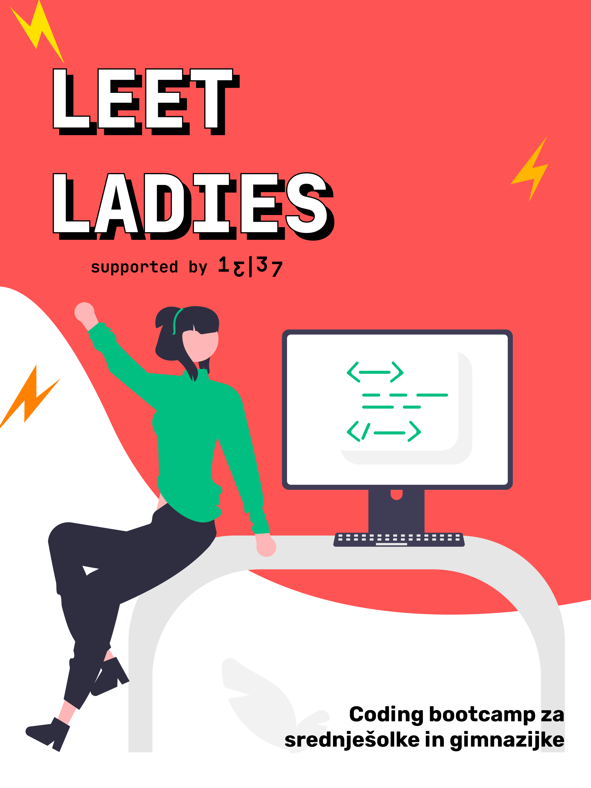

Hello 👋

On this coding bootcamp you will learn the basics of web programming and technologies like HTML, CSS and JavaScript through creating a simple personal website.

# Tools and guidelines 👇

* [Install Visual Studio Code](./tools/installation-guidelines-vs-code.md)
* [Install Discord / Join the Leet Ladies community](./tools/installation-guidelines-discord.md)

# Lessons 👇

* [Lesson 1 - Intro to HTML](./lessons/first-lesson-html.md)
* [Lesson 2 - Intro to CSS](./lessons/second-lesson-css.md)

