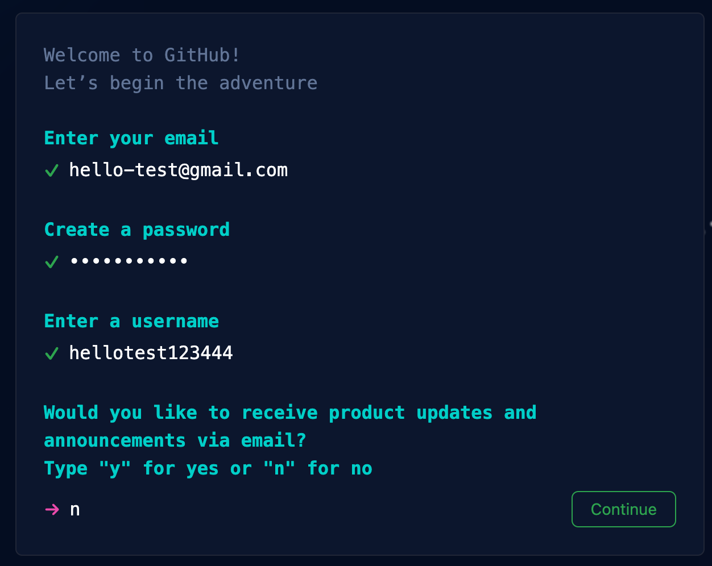

# Personal website - Fourth lesson (Github + Netlify)

## Prerequisites

For this lesson, you will be using Visual Studio Code to create a personal website.
If you do not have Visual Studio Code installed on your computer, please use a text editor like Notepad++ or similar.

❗❗❗ You have to complete the first [**First lesson (HTML)**](./first-lesson.md), second lesson [**Second lesson (CSS)**](./second-lesson.md) and third lesson [**Third lesson (JavaScript)**](./third-lesson.md), before you start with this lesson.

## Introduction

In the first part of this lesson you will focus on Github. You can think of Github as a public library that instead of books contains various coding projects such as your personal website. 

What's true for every library is also true for Github. For example, each book that is part of the library can be lend and accessed by many people that are interested in the topics the book covers. Once you are finished reading the book, you then return it back to the library.

## Github

You use tools such as Github for mainly two reasons:
1. *To not lose your work* - Imagine if something happens with your computer while you work on your website. With Github, you can keep your code safe in the Github library and not be afraid of losing work.  
2. *More people can work on the same code at the same time* - Right now, you are the only one that has access to your code. Imagine if you build your website in a team, together with a friend. In order for your friend to collaborate with you on the website, they have to have access to your website's code too.

In this lesson, you will create a Github account and you will upload your code to Github where others can access it to.

### 📝 Task - Create a Github profile 

Sign up and create a profile with Github.

1. Navigate to [Github](https://github.com/signup).
2. Enter your email and then follow the guidelines. In addition, you will have to enter:
* a password
* a username
* the letter "n". 

3. Next, you will need to solve a puzzle, so that Github knows that you are not a program.
4. Sign in Github with your username and password!

### 📝 Task - Create a repository on Github

### 📝 Task - Push your code to Github

That's it for this fourth lesson!

You did it, you finished all lessons! Bravo!

