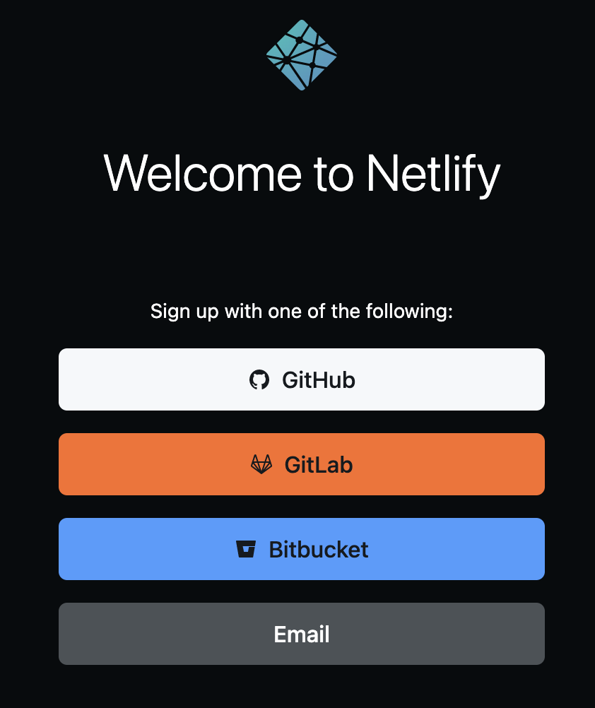
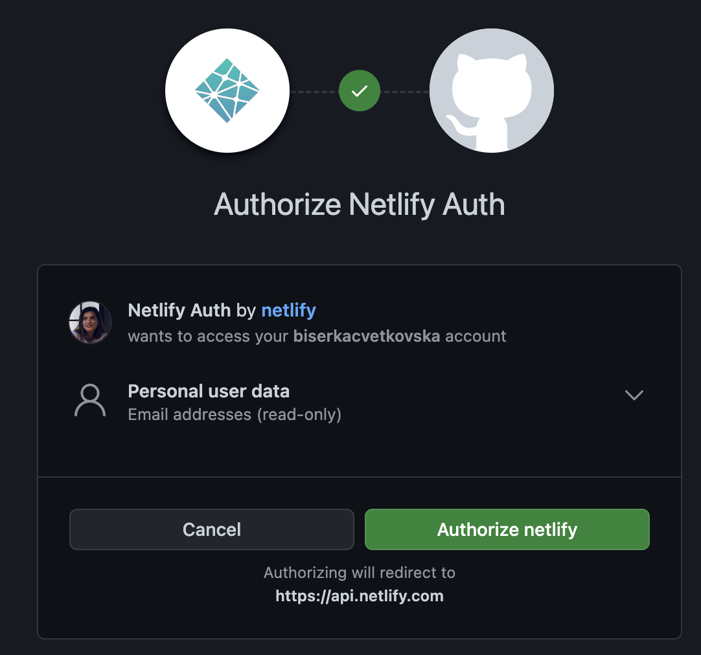
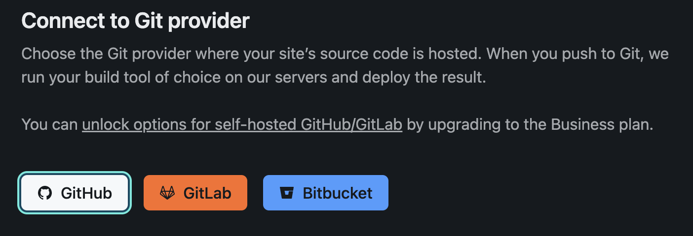
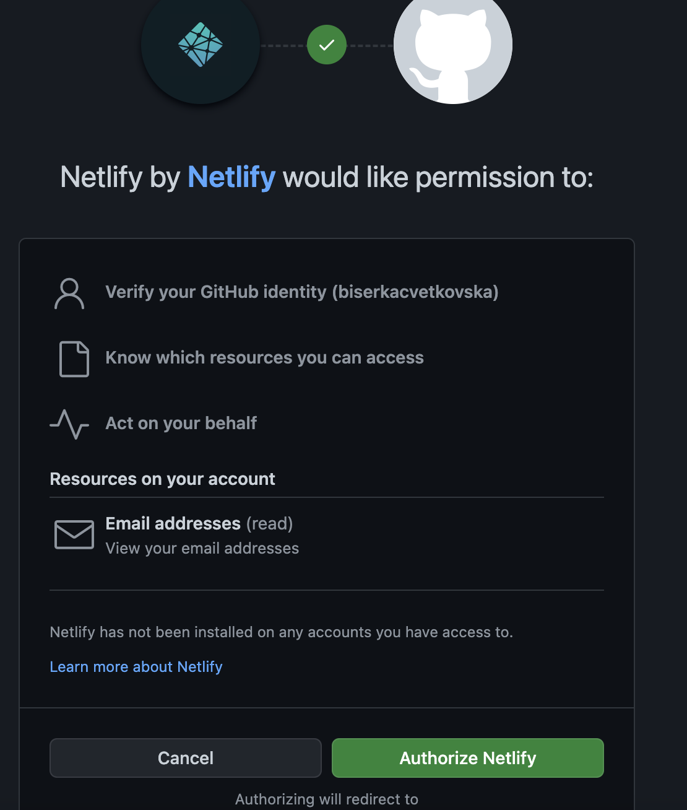
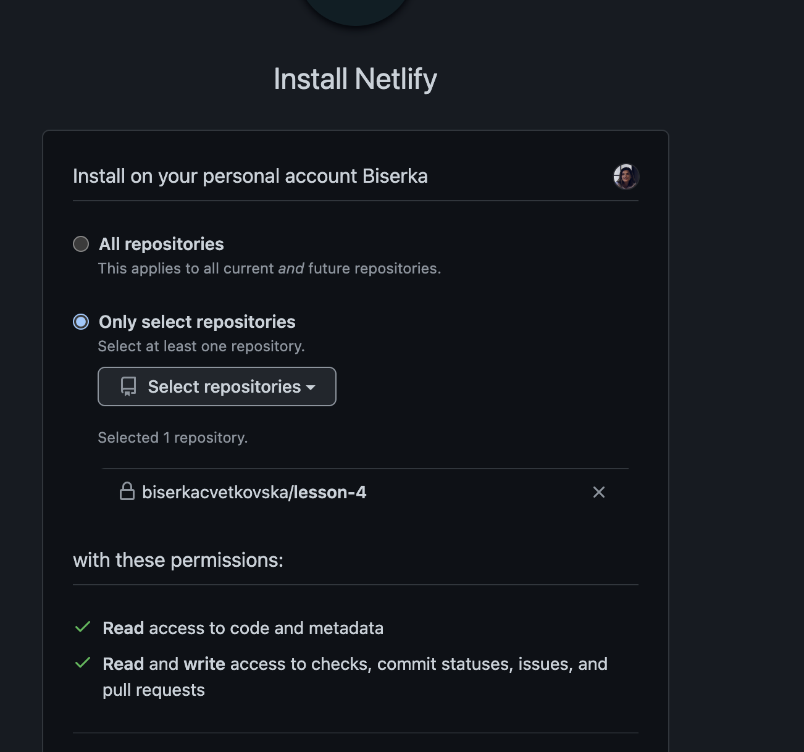

# Personal website - Fourth lesson (GitHub + Netlify)

## Prerequisites

For this lesson, you will be using Visual Studio Code to create a personal website.
If you do not have Visual Studio Code installed on your computer, please use a text editor like Notepad++ or similar.

❗❗❗ You have to complete the first [**First lesson (HTML)**](./first-lesson.md), second lesson [**Second lesson (CSS)**](./second-lesson.md) and third lesson [**Third lesson (JavaScript)**](./third-lesson.md), before you start with this lesson.

## Introduction

In the first part of this lesson you will focus on GitHub. You can think of GitHub as a public library that instead of books contains various coding projects such as your personal website. 

What's true for every library is also true for GitHub. For example, each book that is part of the library can be lend and accessed by many people that are interested in the topics the book covers. Once you are finished reading the book, you then return it back to the library. 
> Disclaimer:  Although, you are not allowed to change the books that you lend from the library, you can think of GitHub as a library that allows such changes. Everytime you return the book with your changes, everyone can lend the book and see those changes too.


In GitHub you use the following commands: `pull` and `push` instead of `lend` and `return`.

## ✨✨✨ GitHub

If you are curious about why tools such as GitHub exist, here are two reasons:
1. *To not lose your work* - Imagine if something happens with your computer while you work on your website. With GitHub, you can keep your code safe in the GitHub library and not be afraid of losing work.  
2. *More people can work on the same code at the same time* - Right now, you are the only one that has access to your code. Imagine if you build your website in a team, together with a friend. In order for your friend to collaborate with you on the website, they have to have access to your website's code too.

In this lesson, you will create a GitHub account and you will upload your code to GitHub where others can access it to.

### 📝 Task - Create a GitHub profile 

Sign up and create a profile with GitHub.

1. Navigate to [GitHub](https://github.com/signup).
2. Enter your email and then follow the guidelines. 
In addition, you will have to enter:
* a password
* a username
* the letter "n". 


3. Next, you will need to solve a puzzle, so that GitHub knows that you are not a program.
4. Sign in to GitHub with your username and password.

### 📝 Task - Install Git

Now when you have a GitHub profile, you will have to install Git on your computer. Git is a tool that tracks the changes you do on your website locally (on your computer). So, whenever you do a change on your website locally, Git will mark the files as changed.

Download [Git](https://git-scm.com/downloads) and install it on your computer.

### 📝 Task - Setup your local Git profile

On your computer you have an application called "Git CMD" (Windows) or "Terminal" (Mac and Linux). 

Open the "Git CMD" or the "Terminal" and type the following lines:

* ``` git config --global user.name "replace-with-your-github-username" ```
* ``` git config --global user.email "replace-with-your-github-email" ```

By executing these two lines in your "Git CMD" or "Terminal" , you have connected Git with your GitHub profile. 

### 📝 Task - Create a repository on GitHub

Go to [GitHub](https://github.com) and sign in with your username and password. Under "Repositories", create a new repository by clicking the green "New" button. 

On the next screen:

1. Set the name of your repositoty to "personal-website"
2. Choose "Private"
3. Choose "Add a README file"
4. Click on the  "Create repository" button

### 📝 Task - Initialize a new git repository

If you remember in the first lesson, you created a folder on your computer called personal-website. This is the folder that has the code and assets for your website. This is the folder that you want to start tracking for changes.

In order to do so, in "Git CMD" or "Terminal" navigate to this folder and type:

``` git init ```

### 📝 Task - Add files to tracking

To add all files in your website folder to tracking, type:

``` git add . ```

If you want to track just a specific file, for example `index.js`, you can type:

``` git add  ./index.js ```

After running the `git add` command, you can also check the status of your files. In order to see which files has changed and how, you can type:

``` git status ```

This command will show you, which files has been added, modified or deleted. 

### 📝 Task - Commit files

At this point you've added the files to a so called staging area. A place where Git is tracking your files. To make the change permanent you need to commit the files. To do so you create a commit with the `git commit` command. A commit represents a saving point in the history of your repository. In order to commit your changes, type the following:

``` git commit -m "first commit" ```

The message "first commit" is called a commit message. You are the one that sets the commit message. The commit message needs to be more descriptive and needs to give an information about what was changed or added in the commit. This helps you create a more readable and easy to track history of your repository. 

For example, if you open a repository on GitHub, you will see that you can information about the number of commits made to that repository. If you click on  "... commits", you will see your history and how your code changed over time.


### 📝 Task - Connect your local Git repository with GitHub

A Git repository is good on your computer, but at some point you want to have backup of your files somewhere and also invite other people to work with you on your repository.

Remember you've already created a repository on GitHub, so the only thing you need to do is to connect your local Git repository with GitHub. The command `git remote add` will do just that.

Before you type this command in your "Git CMD" or "Terminal", navigate to your newly created GitHub repository and find the URL of your repository.


Then type:

`git remote add origin REPLACE_THIS_WITH_YOUR_REPOSITORY_URL`

This command will create a remote, or a connection, named "origin" pointing at the GitHub repository you created earlier.

### 📝 Task - Push your changes to GitHub

So far you've created a connection between your local folder and the GitHub repository. Let's send your local files to GitHub. For that, you can use the `git push` command:

``` git push -u origin master ```

That's it! You did your first push and now all of your code is added on GitHub. 💫 💫 💫 

✅ In the future, if you have changes in your website files, you can always use the following three commands to push your changes to GitHub:

1. `git add .`

2. `git commit -m "type your commit message here"`

3. `git push`


## ✨✨✨ Netlify

Whenever you visit a website on the Internet you need to provide a web address in your browser in order to reach it. For example, to reach Instagram, you type: https://instagram.com, to reach Facebook, you type: https://facebook.com, etc. 

The web address specifically identifies your website. So, when you type the web address in your browser, the browser communicates with a computer called server and fetches the website.

In order for your website to be reachable on the Internet, you will need to upload / host it to a server first. There are a couple of platforms that allow you to host your website on their servers. Such platform is Netlify.

✅ Ever wondered what happens when you [type an address in the address bar in your browser](https://dev.to/wassimchegham/ever-wondered-what-happens-when-you-type-in-a-url-in-an-address-bar-in-a-browser-3dob)? 

### 📝 Task - Sign up to Netlify

1. Navigate to Netlify and [sign up](https://app.netlify.com/signup). 
2. Since you have created a GitHub profile in the first part of this lesson, you can use that account to sign up. On the screen, choose "GitHub".



3. On the next screen authorize Netlify to access your GitHub information.



4. That's it, you now have a Netlify account and you can upload your files to their servers.

### 📝 Task - Import and deploy your website from GitHub

Next, you are going to connect your website on GitHub with Netlify.

1. Import your website files from GitHub by clicking on the button "Import from Git". 
2. On the next screen choose the button "GitHub".



3. On the next screen authorize Netlify to access your GitHub profile.



4. From the list of available projects on GitHub, choose your website project.



5. On the next screen leave everything as is and click the button "Deploy site".
6. Voilà! You website is now ✨live✨, you can visit it by following the web address assign to it by Netlify.

That's it for this fourth lesson!

You did it, you finished ✨all lessons✨! Woohoo!


