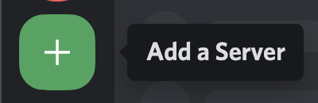
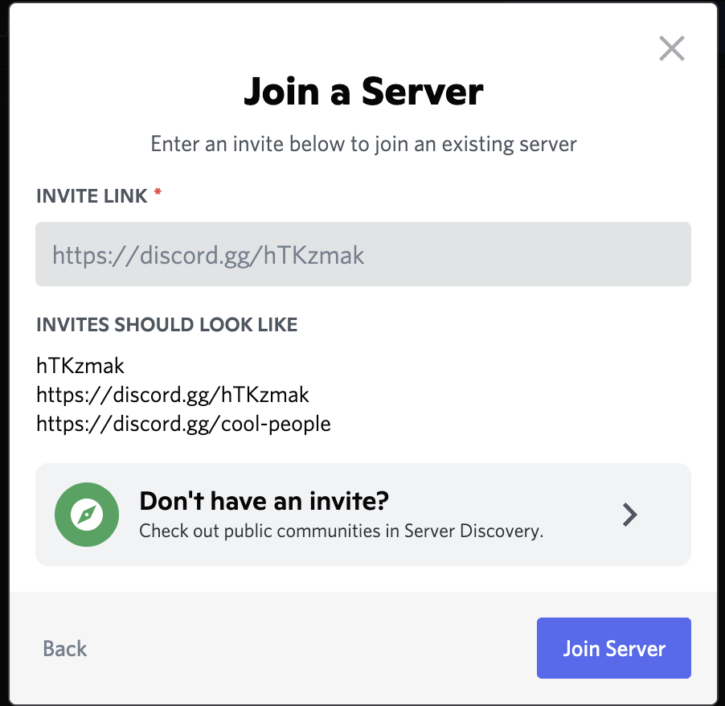
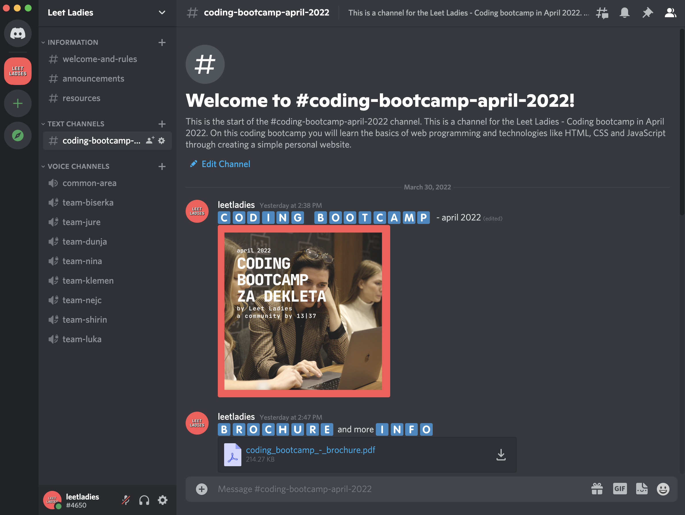

# Discord

Discord is a tool that can be used for communication and a place where you can talk to friends, share information and spend time together. It is built with communities in mind, communities similar to ours (Leet Ladies).

# Installation guidelines

Navigate to the [following link](https://discord.com/download) to download Discord.

The installation is straightforward and similar to installing any other application on your computer. 

Once you have Discord installed on your computer, you will have to register an account. You can create an account using an existing e-mail. 

After you create an account, you can easily log in to Discord and connect to your first community.

# Leet Ladies on Discord

To join the Leet Ladies community on Discord:

1. Click on the "+" button from the left menu.

2. On the next window click on the grey "Join a server" button at the bottom.

3. Copy the following link `https://discord.gg/2wbke5552u` in the "INVITE LINK" field.

 

4. Click on the "Join server" button.

5. You are now ready to explore the Leet Ladies Discord server!

6. Check out the #coding-bootcamp-april-2022 channel where you can find all information about the bootcamp. 

 